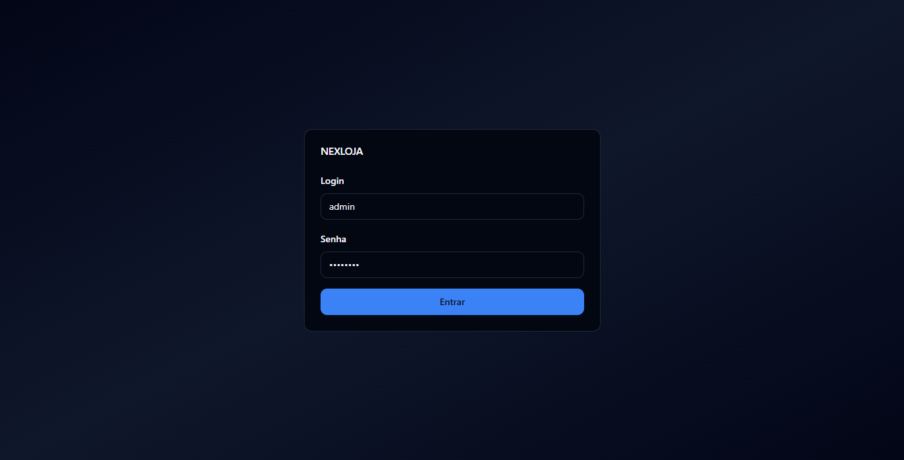
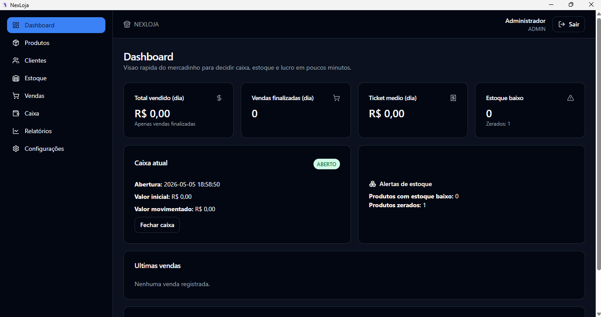
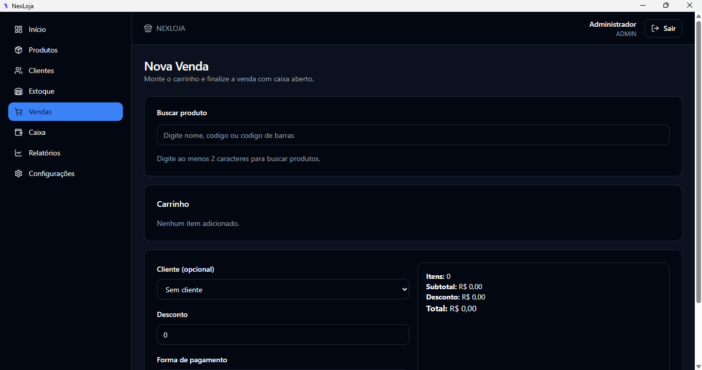
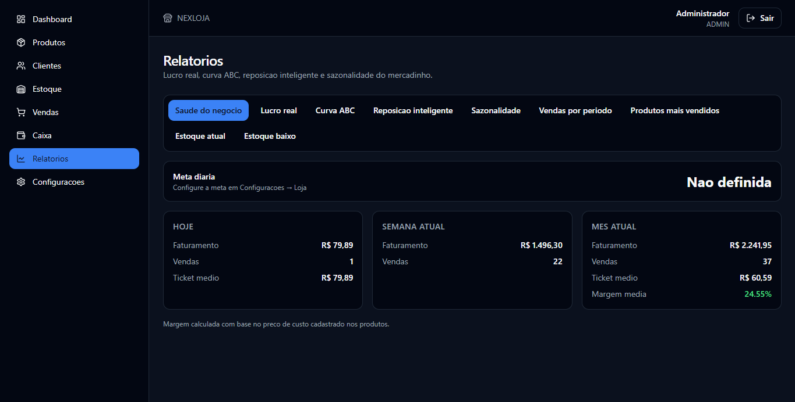

<div align="center">

# NexLoja

**Sistema de gestão desktop para loja de bairro, desenvolvido sob encomenda para cliente real.**

[](https://www.typescriptlang.org/)
[](https://react.dev/)
[](https://www.electronjs.org/)
[](https://sqlite.org/)

> Sistema desktop criado para atender a rotina de uma loja cliente, com controle de caixa, estoque, vendas e indicadores essenciais mesmo sem depender de internet.

**Posicionamento do produto**

- Nicho principal: **mercadinho de bairro**
- Público: dono(a), gerente e operador de caixa sem perfil técnico
- Promessa: **controle caixa, estoque e lucro em 5 minutos por dia**

## Contexto do projeto

O NexLoja foi desenvolvido como **software sob encomenda para uma loja cliente**, com foco em uso real no balcão e na operação diária. A solução prioriza rapidez, clareza visual, operação offline e fluxo simples para quem precisa vender, repor estoque e fechar caixa sem complexidade.

## Screenshots

### Login
Tela de autenticação com acesso por perfil de usuário.



### Dashboard
Visão rápida dos indicadores principais para acompanhar a operação diária.



### Nova venda
Fluxo de lançamento de venda com cálculo automático de subtotal, desconto e total.



### Relatórios
Análises de vendas, produtos e estoque para tomada de decisão.



</div>

---

## O que o sistema faz

| Módulo | Funcionalidades |
|---|---|
| 🔐 **Autenticação** | Perfis ADMIN e VENDEDOR com JWT e bcrypt |
| 📊 **Dashboard** | Indicadores operacionais em tempo real |
| 📦 **Produtos** | CRUD completo, inativação lógica e controle de estoque |
| 👥 **Clientes** | Cadastro completo com histórico de compras |
| 💰 **Caixa** | Abertura, sessão ativa, fechamento e movimentos |
| 🛒 **Vendas** | Nova venda, histórico, detalhes e cancelamento |
| 📈 **Relatórios** | Lucro real, curva ABC, reposição inteligente, sazonalidade e saúde do negócio |

---

## Arquitetura

O projeto segue **Clean Architecture** com separação clara entre domínio, persistência e interface:

```
src/
  app/              # router, providers, layouts, stores globais (Zustand)
  pages/            # telas e composições de página
  features/         # módulo por domínio
    ├── {feature}/
    │   ├── components/    # React components
    │   ├── hooks/         # Custom hooks com React Query
    │   ├── services/      # Orquestração de negócio
    │   ├── validators/    # Validação com Zod
    │   └── types/         # DTOs e tipos específicos
  data/             # persistência
    ├── db/          # conexão e schema SQLite
    └── repositories/ # mappers + chamadas HTTP
  domain/           # lógica pura
    ├── entities/    # tipos de negócio
    ├── enums/       # constantes de domínio
    ├── rules/       # funções puras de negócio com testes
    ├── errors/      # classes de erro específicas
    ├── mappers/     # transformação API → Domain
    └── usecases/    # orquestração complexa
  shared/           # componentes e utilitários reutilizáveis
```

**Princípios aplicados:**
- **Lógica pesada fora das páginas**: concentrada em domain/rules e services
- **Tipagem forte**: TypeScript strict com validação Zod em todas as entradas
- **Regras críticas testadas**: 114 testes unitários cobrindo 97% do código
- **Padrões SOLID**: Mappers, Error classes, Custom hooks, Use cases

**Padrões implementados:**
- **Mappers**: Transformação centralizada API ↔ Domain (4 mappers, zero duplicação)
- **Domain Errors**: Hierarquia de erros específicos com type guards e status HTTP
- **Custom Hooks**: React Query encapsulado por feature (13 hooks, cache gerenciado)
- **Services**: Orquestração de regras de negócio antes de persistência
- **Use Cases**: Padrão para lógica complexa multi-repositório com DI
- **Unit Tests**: 114 testes com Vitest (97% cobertura domain/rules)

---

## 🧪 Testes

Projeto implementa testes unitários para **regras críticas de negócio**:

```bash
# Executar testes uma vez
npm run test

# Modo watch para desenvolvimento
npm run test:ui

# Gerar relatório de cobertura
npm run test:coverage
```

**Cobertura:**
- Domain rules (preço, estoque, venda): 40 testes
- Error handling e mappers: 37 testes
- Services com validação: 37 testes
- **Total: 114 testes, 97% de cobertura**

---

## Regras de negócio principais

- Venda só finaliza com caixa aberto pelo usuário atual
- Finalizar venda baixa estoque e registra movimentos automaticamente
- Cancelamento de venda devolve estoque e exclui do faturamento
- Controle de sessão de caixa por usuário (sem sessões duplicadas)
- Produto com código único; valores monetários e estoque nunca negativos

---

## Stack completa

**Frontend:** React 18, TypeScript, Vite, Tailwind CSS, shadcn/ui, React Router, TanStack Query, Zustand, React Hook Form e Zod

**Testing:** Vitest 1.1, @testing-library/react, jsdom e 114 testes unitários

**Desktop:** Electron, Node.js, Express, JWT e bcryptjs

**Banco de dados:** SQLite (10 tabelas: usuários, produtos, clientes, vendas, estoque, caixa e mais)

---

## Como rodar localmente

**Pré-requisitos:** Node.js 20+, npm

```bash
# Instalar dependências do frontend e backend
cd front && npm install
cd ../backend && npm install

# Rodar todos os testes
cd front && npm run test

# Rodar em modo desenvolvimento (navegador)
cd front && npm run dev
# Em outro terminal, iniciar o backend:
node backend/src/index.js

# Rodar como app desktop (Electron)
cd front && npm run electron:dev

# Gerar instalador .exe
cd front && npm run electron:build
```

O instalador é gerado em `front/release/`.

**Credencial padrão do seed:**
```
login: admin
senha: admin123
```

---

## Banco de dados

Schema com 10 tabelas criado e migrado automaticamente na inicialização:

`usuarios` · `configuracao_loja` · `categorias` · `produtos` · `clientes` · `caixa_sessoes` · `vendas` · `itens_venda` · `movimentacoes_estoque` · `caixa_movimentos`

---

## Download (Windows)

Baixe a versão instalável do app desktop (.exe) em **Releases**:

**[Baixar NexLoja para Windows](https://github.com/NicolasCardoso2/nexloja/releases)**

Versão atual: **0.1.3**

Ao executar o instalador, ele cria atalho no Menu Iniciar e na área de trabalho.

## Notas da versão 0.1.3

- Correção de instância única no Electron (duplo clique não abre múltiplas janelas)
- Correção de inicialização do backend empacotado com `ELECTRON_RUN_AS_NODE=1`
- Ajustes de autenticação no app desktop
- Melhorias de UX e revisão de textos em português (acentos e termos)

---

<div align="center">

Projeto desenvolvido por [Nicolas Cardoso](https://github.com/NicolasCardoso2) sob encomenda para cliente do varejo · [LinkedIn](https://www.linkedin.com/in/nicolas-cardoso-vilha-do-lago-2483b1322/)

</div>
